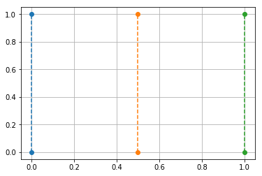
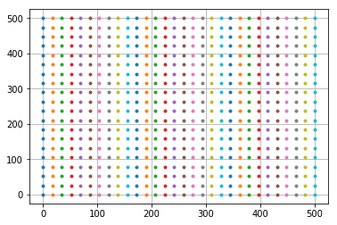
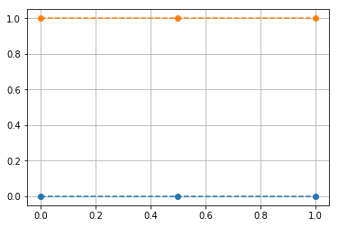

# numpy.meshgrid()

## Step 1 : 创建网格点矩阵

```python
import numpy as np
import matplotlib.pyplot as plt
X = np.array([[0,0.5,1],[0,0.5,1]])
print("X的维度：{}，shape：{}".format(X.ndim,X.shape))
Y = np.array([[0,0,0],[1,1,1]])
print("Y的维度：{}，shape：{}".format(Y.ndim,X.shape))

plt.plot(X,Y,'o--')
plt.grid(True)
plt.show()
```
X的维度：2，shape：(2, 3)  
Y的维度：2，shape：(2, 3)  


## Step 2 : meshgrid()的作用

使用meshgrid方法，你只需要构造一个表示x轴上的坐标的向量和一个表示y轴上的坐标的向量;然后作为参数给到meshgrid(),该函数就会返回相应维度的两个矩阵;  

例如,你想构造一个2行3列的矩阵网格点,那么x生成一个shape(3,)的向量,y生成一个shape(2,)的向量,将x,y传入meshgrid(),最后返回的X,Y矩阵的shape(2,3)

```python
x = np.array([0,0.5,1])
y = np.array([0,1])
xv , yv = np.meshgrid(x,y)

print(xv)
print(yv)
print("xv的维度:{},shape:{}".format(xv.ndim, xv.shape))
print("yv的维度:{},shape:{}".format(yv.ndim, yv.shape))

plt.plot(xv, yv, 'o--')
plt.grid(True)
plt.show()
```
[[0.  0.5 1. ]  
 [0.  0.5 1. ]]  
[[0 0 0]  
 [1 1 1]]  
xv的维度:2,shape:(2, 3)  
yv的维度:2,shape:(2, 3)  


### 生成一个20行30列的网格点矩阵
```python
x = np.linspace(0,500,30)
print("x的维度:{},shape:{}".format(x.ndim, x.shape))
# print(x)
y = np.linspace(0,500,20)
print("y的维度:{},shape:{}".format(y.ndim, y.shape))
# print(y)

xv,yv = np.meshgrid(x, y)
print("xv的维度:{},shape:{}".format(xv.ndim, xv.shape))
print("yv的维度:{},shape:{}".format(yv.ndim, yv.shape))

plt.plot(xv, yv, '.')
plt.grid(True)
plt.show()
```
x的维度:1,shape:(30,)  
y的维度:1,shape:(20,)  
xv的维度:2,shape:(20, 30)   
yv的维度:2,shape:(20, 30)  


<br/>
indexing只是影响meshgrid()函数返回的矩阵的表示形式，但并不影响坐标点  

```python
x = np.array([0, 0.5, 1])
y = np.array([0,1])

xv,yv = np.meshgrid(x, y,indexing='ij')
print("xv的维度:{},shape:{}".format(xv.ndim, xv.shape))
print("yv的维度:{},shape:{}".format(yv.ndim, yv.shape))
print(xv)
print(yv)

plt.plot(xv, yv, 'o--')
plt.grid(True)
plt.show()
```
xv的维度:2,shape:(3, 2)  
yv的维度:2,shape:(3, 2)  
[[0.  0. ]  
 [0.5 0.5]  
 [1.  1. ]]  
[[0 1]  
 [0 1]  
 [0 1]]  



